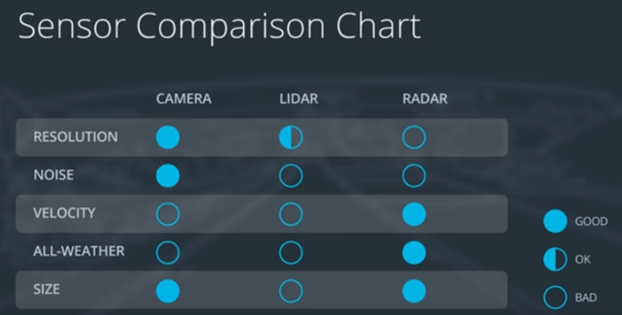
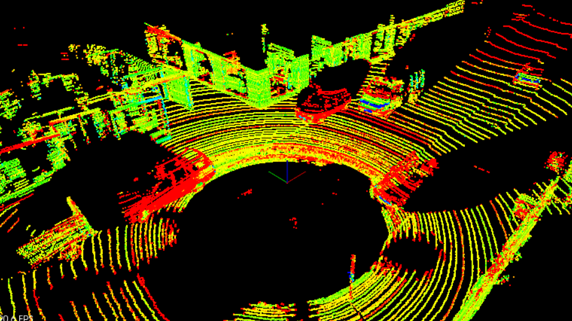

# Sensor Fusion Self-Driving Car Course
*Udacity Nanodegree - ongoing since January 2022*

## Table of Contents
  - [Course Overview](#course-overview)
    - [Sensors](#sensors)
  - [Completed Projects](#completed-projects)
    - [Project 1: Lidar Obstacle Detection](#project-1-lidar-obstacle-detection)

## Course Overview

In this course, I am learning about three sensor technologies integral for self-driving vehicles: LiDAR, camera, and radar. When outputs from each sensor are fused, vehicles can detect and track non-linear motion and objects in the environment. This fusion of multiple sensors is the basis for collision detection, cruise control, and other decision trees for self-driving vehicles.

The course contains four projects with each adding one additional sensor technology. Currently, I completed one of the four:
1. Lidar Obstacle Detection: using LiDAR and machine learning algorithms to detect objects in a point cloud stream
<!-- 2. 2D Feature Tracking: using camera data with LiDAR to detect and calculate distances between an ego car and front car -->

### Sensors

LiDAR, camera, and radar are fused together to overcome each of their weaknesses (Figure 1). 

 

<figcaption><b>Figure 1: Comparison of sensors</b></figcaption>

 

Below is a list of each sensor with their descriptions and weaknesses:
- **LiDAR**: emits infrared light from a rotating sensor to scan 3D points of the environment into a "point cloud" (Figure 2). The scan resolution is dependent on the reflective properties of materials and reduced in adverse environmental conditions such as snow, heavy rain or fog. Sometimes the resulting point cloud is not dense enough for object detection algorithms to locate vehicles or pedestrians.
- **Camera**: focus on both close and far-field, watch for braking vehicles, crossing pedestrians, traffic lights, and signage. High-resolution cameras produce precise images of a vehicle's surroundings. Like human eyes, however, performance at night is significantly reduced, making them less reliable in locating objects with the required detection rates and positional accuracy.
- **Radar**: emits radio waves which reflect off objects. Reflected waves are analyzed to calculate distance and relative speed of surrounding vehicles. It is robust against adverse weather conditions like heavy snow and thick fog. However, radar does not produce imagery and drops performance when detecting small or organic objects.

 

<figcaption><b>Figure 2: Point cloud sample from Project 1</b></figcaption>
 

## Completed Projects
Below are descriptions of completed projects. Each project uses C++ and the OpenCV C++ library.

### Project 1: Lidar Obstacle Detection
The goal of this project was to detect objects from a point cloud stream of traffic on a street (Figure 3). For this detection pipeline, I implemented the following algorithms:
1. RANSAC: used to separate the point cloud between road plane and obstacle plane 
2. KD-Tree: a quick and efficient search algorithm that identifies regions within the point cloud that are point clusters
3. Euclidean clustering: establishes individual indices on the KD-tree clusters and encompasses the clusters with a bounding box

For more details, please check out the repo [here](Project_1_Lidar_Obstacle_Detection/).
 

<figcaption><b>Figure 3: Object detection from point cloud stream</b></figcaption>
 

<!-- ## Project 2: 2D Feature Tracking -->

